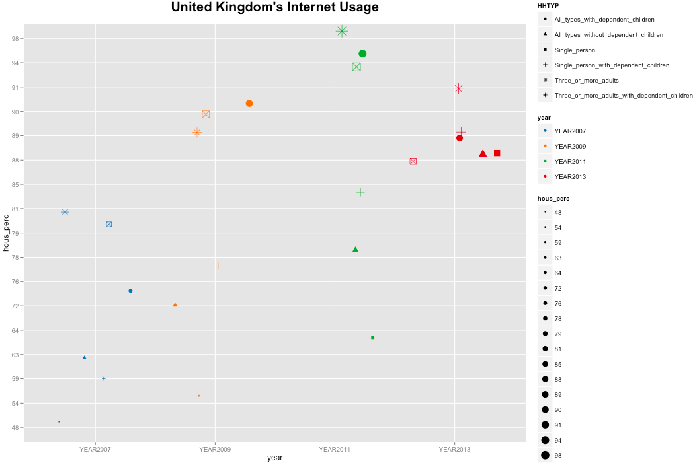
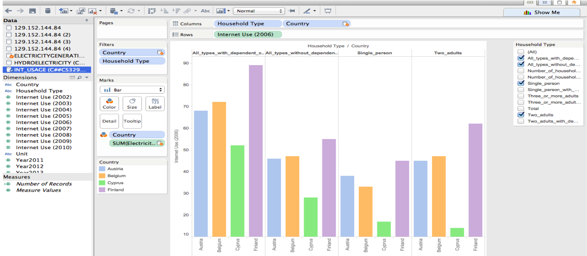
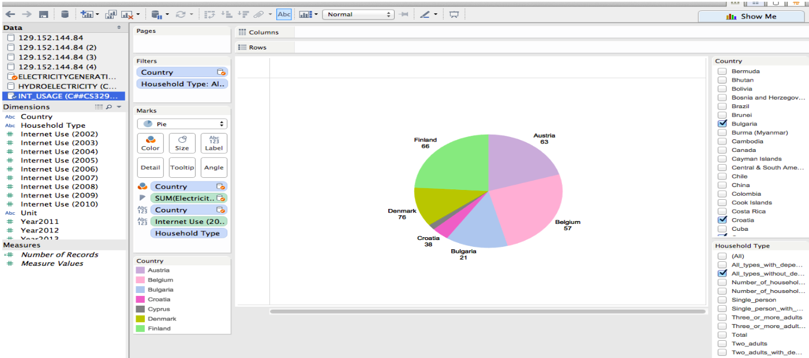
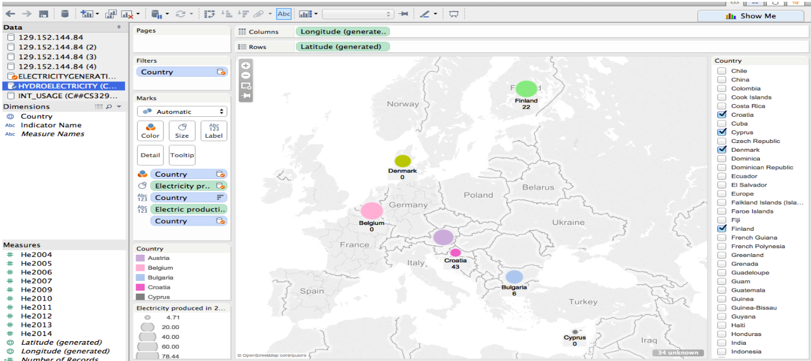
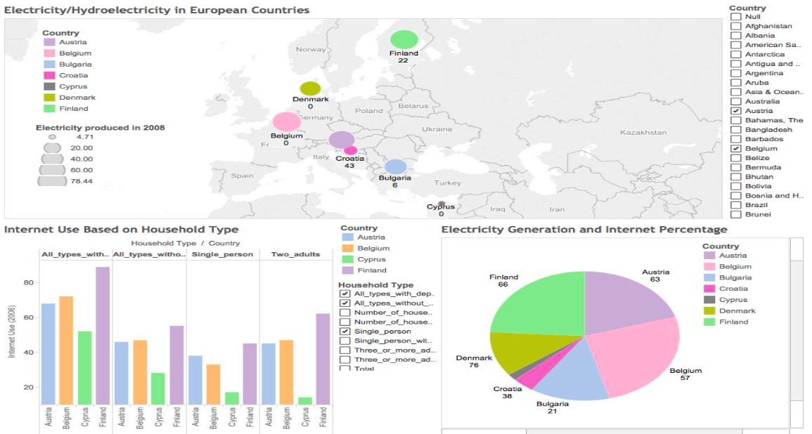
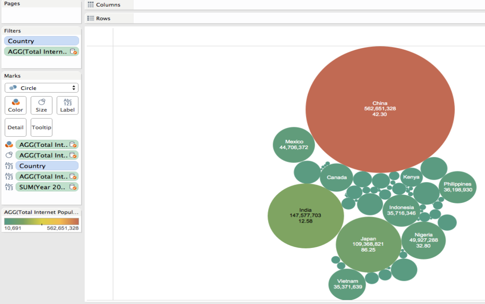
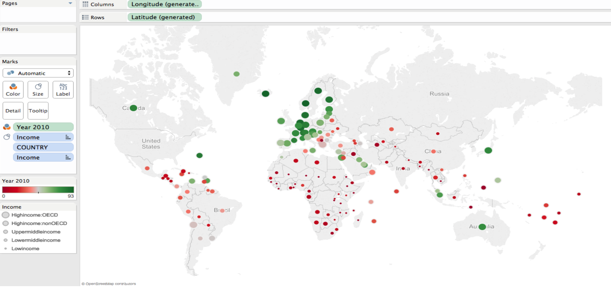
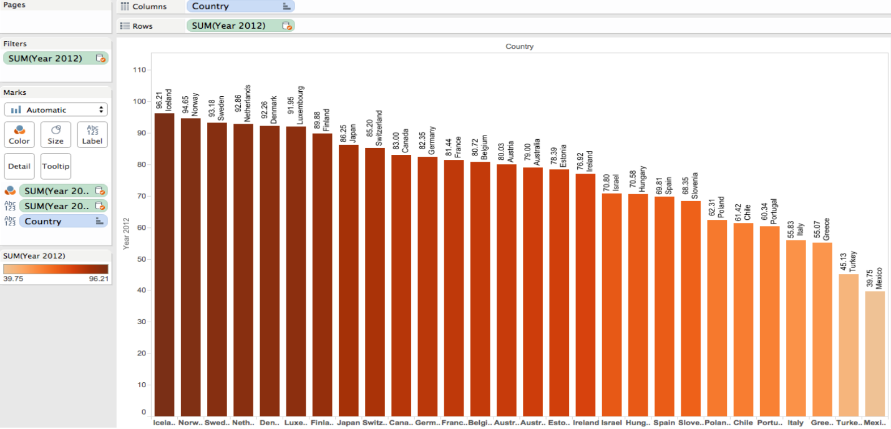
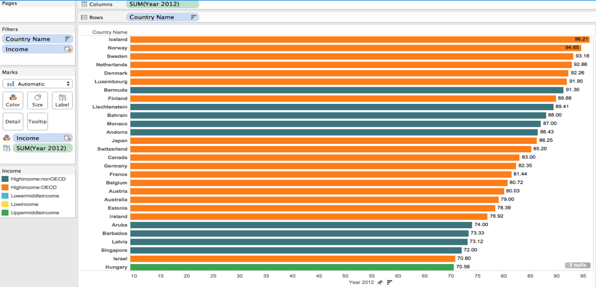

Final Project
====
**Group members: Fabiana Latorre, Oliver Benton Javier, Ernesto Canales, and Nikolaj Plagborg-Moller.**  

Our datasets can be found at 'http://catalog.data.gov/dataset/annual-electricity-generation-1980-2009-dff2e' (Electricity Generation data set) and 'http://catalog.data.gov/dataset/eia-data-2008-international-coal-reserves-95724' (Coal Reserves data set), 'http://data.worldbank.org/about/country-and-lending-groups' (Income Groups data set), http://data.worldbank.org/indicator/IT.NET.USER.P2 (Internet Use data set), https://app.enigma.io/table/gov.eu.eurostats.tb.t-icts.t-isoc.t-isoc-pi.t-isoc-pibde15.t-isoc-bde15b.tin00088 (Household Internet Use data set), http://data.worldbank.org/indicator/EG.ELC.HYRO.ZS (Hydroelectric data set).
  
**Pie Diagram in R**

We fetch and join data describing the electricity generation and coal reserves of different regions.

```{r}
source('../01 Data/DataPie.R', echo=TRUE)
```

We want to create a plot that shows how each region's electricity production relates to the size of its coal reserves. Searching the internet, we discovered that each ton of coal can produce about 1904 kilowatthours of electricity (source: http://www.eia.gov/tools/faqs/faq.cfm?id=667&t=2). The idea is to create a mutated field that converts the electricity production to coal and displays what fraction of the coal reserve that corresponds to. Another mutated field states the remaining fraction which is needed to create a pie diagram. It was also necessary for the pie diagram to use the 'gather' function in order to asssemble the mutated field descriptions in one column, and all the numbers in another column. We filtered in only four important regions to simplify the visualization. Below we show the resulting table.

```{r}
source('../02 Data Wrangling/WranglingPie.R', echo=TRUE)
```

For the actual visualization, we used ggplot's pie diagram function, which requires you to first produce a bar graph. We facet wrapped it by country, modified the axis, and finally added the 'coord_polar' layer producting the pie diagram. Each whole pie corresponds to the entire coal reserve of that country, and the red area signifies how the annual electricity production compares. Unfortunately, each pie is minimized quite a bit by R Markdown, but we have bigger figures in our powerpoint presentation.

```{r}
source('../03 Visualizations/VisualizationPie.R', echo=TRUE)
```

**Point Diagram in R**
We fetch the data for our point diagram.
```{r}
source('../01 Data/DataPoint.R', echo=TRUE)
```

The Data Wrangling shows that we filtered householdtypes, many of which were repeated in the dataset. For that reason, we later used the function distinct, to get rid of all the duplicates. Also, we used gather to rearrange the years of the data and be able to used them as our x-axis. As many of the household percentages were the same for each household type, we used geom_jitter, instead of using geom_point, to avoid overlaps in the dots. We also used the function ggthemes, to use the same colors seen in tableau, and to add a title to the plot.

```{r}
source('../02 Data Wrangling/WranglingPoint.R', echo=TRUE)
```

The plot shows internet usage in the United Kingdom. It is interesting to see that until 2013, internet usage varied depending on the type of household. As time goes by, internet is more accesible for all types of households. Since R Markdown squished our plot, we put in a png picture instead.



**Bar Diagram in Tableau**

This bar graph depicts Internet use based on household type amongst four european countries. First we chose to select four countries and household types by using quick filters. Then we dragged the 2006 Internet use dimension onto the row shelf and the country dimension onto the color marks card. From the data it is clear that Finland uses the Internet more than the other countries. Lastly it seems that despite the household type, dependent children are associated with increased internet use.



**Pie Diagram in Tableau**

This pie chart shows each country’s electricity generation and internet percentage. Again we used quick filters to select the countries and household type. Each pie slice indicates the generation of electricity for each country and the labeled numbers indicate the percentage of household internet use of those countries. Belgium seems to be the highest electricity consumer, but Denmark has the highest internet use.



**Geo Map in Tableau**

This map plot visualizes the total electricity produced by each country, indicated by the size of the icons and the percent of electricity produced by hydroelectric sources, which are indicated by the numbers. We dragged the latitude and longitude to the rows and columns shelves and used a quick filter to select the countries. Then we dragged the electricity measure onto the size mark and country onto the color and label mark. Lastly, we dragged the hydroelectric measure onto the label mark. It appears that Belgium has the highest electricity generation in total, but Croatia has the most electricity produced from hydroelectric sources.



**Dashboard in Tableau**

Here we collected the three former visualizations on a dashboard.



**Total Internet Population graph**

For our Total Internet Population graph, we used the population from each country and the percentage of Internet users. In order to calculate the total population for each country, we created a calculated Field which multiplies said percentage times the population times one million, since the population is in millions. The formula had to use a special code to gather data from two different data sets. We can easily tell that China and India conform the highest portion of Internet Users of the World.



**Total Internet Population graph**

We created a geographical graph that shows each country’s percentage of internet users. In this one we also used a categorical that divided the countries by income groups. We noticed that most OECD countries had a higher percentage than the rest.

**Internet Users Map**



In order to better understand the OECD subdivision of countries, we did two separate visualizations. One that represented solely OECD countries and another that used the rest of the World. We could see that OECD countries (in orange) have a clear advantage over the rest of the World. Although there are some countries that have a high percentage and do not form part of OECD (Monaco, Latvia, Singapore).

**OECD Countries**



**All Other Countries**



- The end
